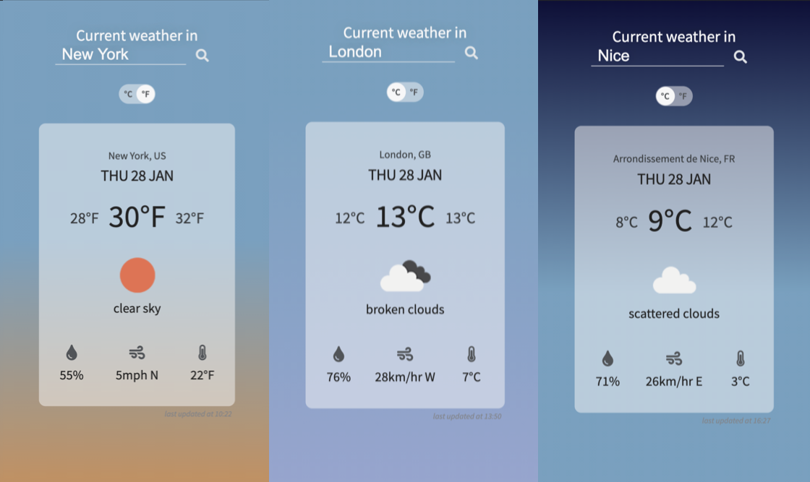
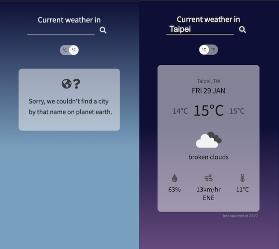

# _Current Weather_ with OpenWeather

How's the weather in Osaka right now? What about Barcelona? Using [OpenWeather](https://openweathermap.org/)'s API, _Current Weather_ is a web application that allows users to check the current weather conditions in numerous cities around the world. This project was built to demonstrate understanding of asynchronous JavaScript programming using async/await and appropriate error handling for Promises.

:zap: [Live Demo](https://kuosandys.github.io/current-weather/) :zap:

## Features

The app interface is designed to communicate many pieces of information at once without overwhelming the user. Secondary information is de-emphasized by size and colour. The Celsius to Fahrenheit toggle allows users to quickly switch between metric and imperial units of measurement without reloading the page or submitting a new search. The background colours have 4 modes (early morning, high noon, late afternoon, night), and are determined by the sunset/sunrise time at the selected city.

## Built With

- JavaScript (Vanilla)
- CSS (compiled with Sass from SCSS)
- HTML

## Sources

This project was built as part of The Odin Project's JavaScript curriculum. Project guidelines can be found [here](https://www.theodinproject.com/courses/javascript/lessons/weather-app).
